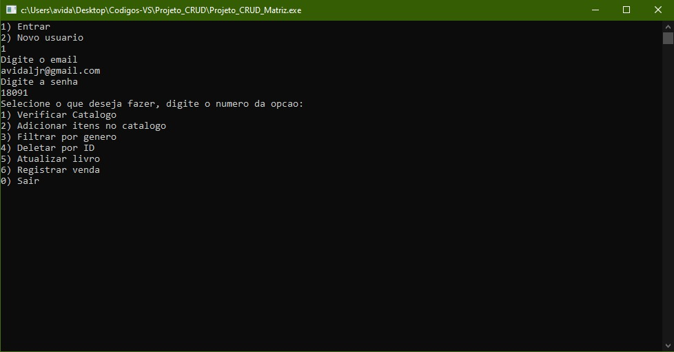

# Projeto CRUD - LIVRARIA - PROGRAMAÇÃO ESTRUTURADA



> Linha adicional de texto informativo sobre o que o projeto faz. Sua introdução deve ter cerca de 2 ou 3 linhas. Não exagere, as pessoas não vão ler.

### Ajustes e melhorias

O projeto contou com diversasa atualizações nessa segunda parte, entre elas:

- [x] Sistema de login
- [x] Criptografia
- [x] Sistema de estoque
- [x] Sistema de registro de venda
- [x] Matrizes
- [x] Entre diversas refatorações

## Pré-requisitos

Tenha instalado em sua máquina o **git** e alguma IDE de programação, utilizamos aqui o **VISUAL STUDIO CODE**

## 🚀 Instalando

Para instalar o <nome_do_projeto>, siga estas etapas:

Copie esse repositório:
```
git clone https://github.com/marinhomateus/projeto-pe
```

Em seguida execute o arquivo Projeto_CRUD_Matriz.c

Adicione comandos de execução e exemplos que você acha que os usuários acharão úteis. Fornece uma referência de opções para pontos de bônus!

## 📫 Contribuindo para <nome_do_projeto>
<!---Se o seu README for longo ou se você tiver algum processo ou etapas específicas que deseja que os contribuidores sigam, considere a criação de um arquivo CONTRIBUTING.md separado--->
Para contribuir com <nome_do_projeto>, siga estas etapas:

1. Bifurque este repositório.
2. Crie um branch: `git checkout -b <nome_branch>`.
3. Faça suas alterações e confirme-as: `git commit -m '<mensagem_commit>'`
4. Envie para o branch original: `git push origin <nome_do_projeto> / <local>`
5. Crie a solicitação de pull.

Como alternativa, consulte a documentação do GitHub em [como criar uma solicitação pull](https://help.github.com/en/github/collaborating-with-issues-and-pull-requests/creating-a-pull-request).

## 🤝 Colaboradores

Agradecemos às seguintes pessoas que contribuíram para este projeto:

<table>
  <tr>
    <td align="center">
      <a href="#">
        <br>
        <sub>
          <b>Mateus Marinho</b>
        </sub>
      </a>
    </td>
    <td align="center">
      <a href="#">
        <br>
        <sub>
          <b>Rafael Teixeira</b>
        </sub>
      </a>
    </td>
    <td align="center">
      <a href="#">
        <br>
        <sub>
          <b>Antonio Carlos</b>
        </sub>
      </a>
    </td>
    <td align="center">
      <a href="#">
        <br>
        <sub>
          <b>Marcos Lucinda</b>
        </sub>
      </a>
    </td>
  </tr>
</table>
